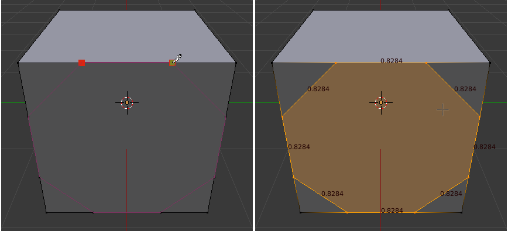

# Proportional Subdivide
Blender add-on to help subdivide edges with mathematical precision

This is especially useful for those who want to construct precise geometric shapes without wanting to worry about coding that in python.

## Example
Say you want to place a octagon onto the side of a cube.

We know that we want all sides to be of equal length, well call that length `a`, therefore each of the corner pieces is of length `a/sqrt(2)`. And this is all you need to know for this addon:

You can then subdivide a single edge, or multiple edges at once:

Finally you can use the knife tool [K] to cut the hexagon out of the square face:

Et voila! Eight equal length edges.

## Notes

If the subdivisions aren't symmetrical, you might have to use the reverse toggle for some edges as the underlying mesh interface always returns the edge vertices in a fixed order that is seemingly random. 
